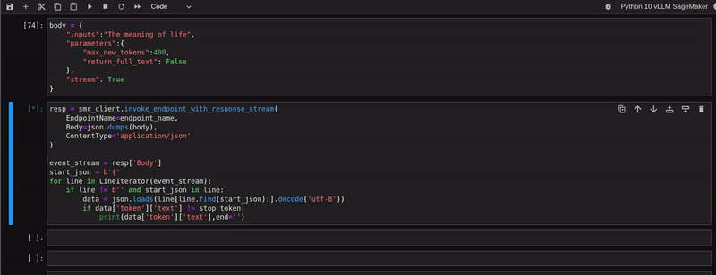

# Deploy LLM with vLLM on SageMaker in 13 lines

This repository contains the code for the Medium article titled [Deploy LLM with vLLM on SageMaker in 13 only lines of code]([https://mrmaheshrajput.medium.com](https://mrmaheshrajput.medium.com/deploy-llm-with-vllm-on-sagemaker-in-only-13-lines-of-code-1601f780c0cf)).



## Repository Contents

- `.flake8`: Configuration file for flake8 used for precommit checks.
- `.pre-commit-config.yaml`: Configuration file for pre-commit hooks.
- `main.ipynb`: **Jupyter notebook containing all the code.**
- `Makefile`: Makefile with recipes for various tasks:
  - Creating Conda environment.
  - Setting up precommit.
  - Creating IPython kernel for Jupyter notebook.
  - Removing Conda environment.
- `README.md`: This file.
- `vllm-sagemaker_env.yml`: Conda environment file with all dependencies.

## Complete Code for deployment

```python
import io
import sagemaker
import boto3
import json


# Your IAM role that provides access to SageMaker and S3.
# See https://docs.aws.amazon.com/sagemaker/latest/dg/automatic-model-tuning-ex-role.html
# if running on a SageMaker notebook or directly use
# sagemaker.get_execution_role() if running on SageMaker studio
iam_role = "arn:aws:iam::1111111111:role/service-role/AmazonSageMaker-ExecutionRole-00000000T000000"

# manages interactions with the sagemaker apis
sagemaker_session = sagemaker.session.Session()

region = sagemaker_session._region_name

# boto3 Sagemaker runtime client to invoke the endpoint
# with streaming response
smr_client = boto3.client("sagemaker-runtime")

# get the lmi image uri
# available frameworks: "djl-lmi" (for vllm, lmi-dist), "djl-tensorrtllm" (for tensorrt-llm),
# "djl-neuronx" (for transformers neuronx)
container_uri = sagemaker.image_uris.retrieve(
    framework="djl-lmi", version="0.28.0", region=region
)

# instance type you will deploy your model to
# Go for bigger instance if your model is bigger
# than 7B parameters
instance_type = "ml.g5.4xlarge"

# create a unique endpoint name
endpoint_name = sagemaker.utils.name_from_base("phi3-4k-lmi-endpoint")

# create your SageMaker Model
# phi-3-mini-4k model fits well on our instance's GPU
# as it only has 3.8B parameters
model = sagemaker.Model(
    image_uri=container_uri,
    role=iam_role,
    # specify all environment variable configs in this map
    env={
        "HF_MODEL_ID": "microsoft/Phi-3-mini-4k-instruct",
        "OPTION_ROLLING_BATCH": "vllm",
        "TENSOR_PARALLEL_DEGREE": "max",
        "OPTION_MAX_ROLLING_BATCH_SIZE": "2",
        "OPTION_DTYPE": "fp16",
        # Streaming will work without this variable
        # "OPTION_ENABLE_STREAMING":"true"
    },
)

# deploy your model
model.deploy(
    instance_type=instance_type,
    initial_instance_count=1,
    endpoint_name=endpoint_name,
)
```
